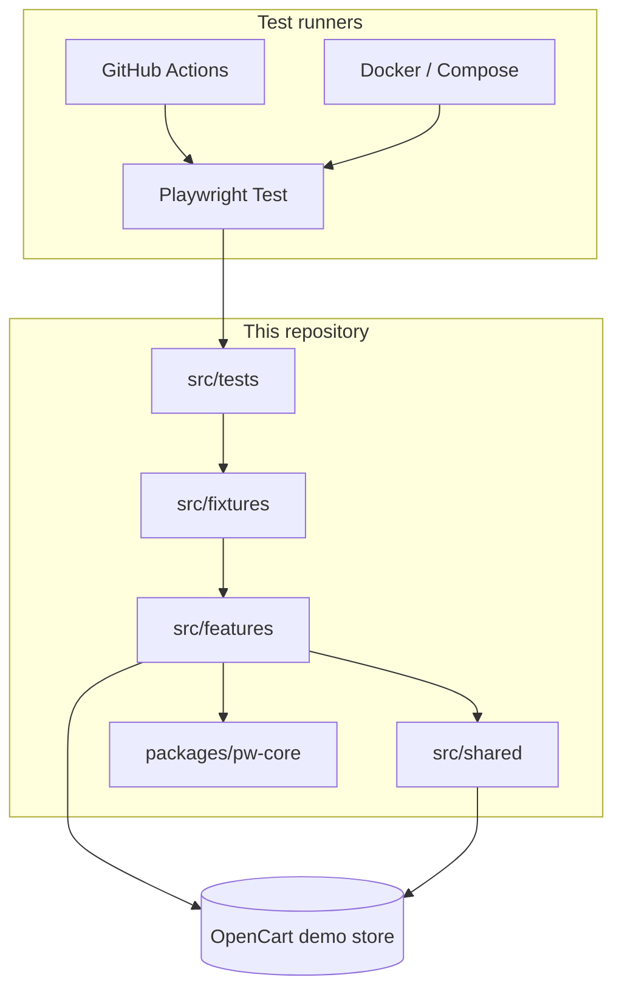
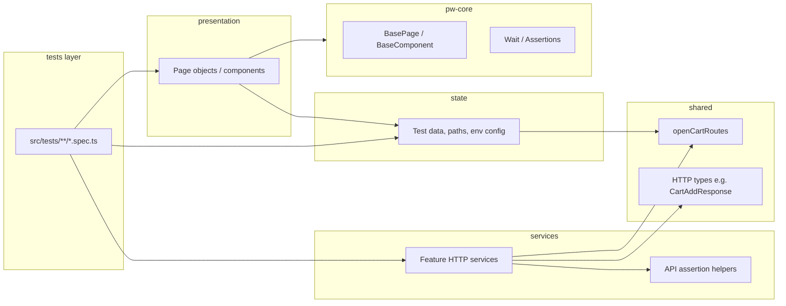
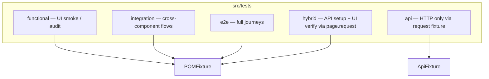
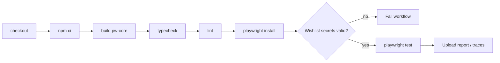

# Architecture — OpenCart Playwright Automation

This document describes the test automation system design for the OpenCart demo store (`BASE_URL`, default `https://awesomeqa.com/ui/`).

## System context

## Feature modules

Each domain area is an **independent feature module** under `src/features/<name>/`. Modules expose a public API through `index.ts` only.

| Feature | State | Services | Presentation |
| ------- | ----- | -------- | -------------- |
| **home** | `HomePaths` | — | `HomePage`, `Header`, `Footer` |
| **catalog** | `products`, `getSearchTerm`, `requireProductId` | `CatalogService`, catalog assertions | `ProductListingPage`, `Ribbon` |
| **cart** | `CartPaths` | `CartService`, cart assertions | `CartPage` |
| **auth** | `credentials`, `AuthPaths`, `LOGIN_REJECTION_PATTERN` | — | `LoginPage`, `LogoutPage` |
| **checkout** | `billingData` | — | `CheckoutPage`, `OrderPlacementResultPage` |
| **wishlist** | — | — | `WishListPage` |

Auth credential **state** lives in `features/auth/state/credentials.ts`. Playwright skip/fail wiring for wishlist E2E is in `src/fixtures/wishlistCredentials.ts`.

## Layer model (per feature)

### Import rules

| Layer | May import | Must not import |
| ----- | ---------- | --------------- |
| **presentation** | Same-feature `state`, `@opencart-auto/pw-core` | Other features, `services`, test specs |
| **state** | `shared` routes/types | `presentation`, `services`, other features' state |
| **services** | `shared`, same-feature `state` | `presentation`, other features' internals |
| **tests** | Feature `index.ts`, fixtures | Feature `presentation/` or `state/` paths directly |

**Cross-feature composition** happens in tests and fixtures (e.g. order flow uses catalog + cart + checkout page objects injected together).

Layer boundaries are enforced in `eslint.config.mjs` via `no-restricted-imports` on presentation, state, services, and tests (feature barrels and `index.ts` re-exports are exempt).

## Shared layer

`src/shared/` holds cross-cutting infrastructure with **no UI and no test data**:

- `services/routes/openCartRoutes.ts` — OpenCart route path constants
- `services/http/types.ts` — shared response types (e.g. `CartAddResponse`)

Feature `state` modules may re-export route slices as domain paths (`CartPaths`, `AuthPaths`, `HomePaths`).

## pw-core workspace package

`packages/pw-core` is a **compile-time library** consumed by all features:

- `BasePage`, `BaseComponent`
- `SoftAssertions`, `HardAssertions`, `Wait`
- Generic interfaces: `IProduct`, `IBillingDetails`

It is built via `npm run build` (also `postinstall` / `pretest`). Output lives in `packages/pw-core/dist/` (gitignored).

## Test taxonomy

| Layer | Fixture | Typical imports |
| ----- | ------- | --------------- |
| functional / integration / e2e | `POMFixture` | Page objects via fixtures |
| hybrid | `POMFixture` | Page objects + `sessionCartService` (`page.request`) |
| api | `ApiFixture` | `cartService`, `catalogService` (isolated `request`) |

`src/tests/seed.spec.ts` is generator scaffolding only (`testIgnore` in `playwright.config.ts`).

## Fixtures

Playwright fixtures act as the DI container. Shared helpers live in `src/fixtures/fixtureHelpers.ts` (`pageObject`, `serviceFromRequest`, `serviceFromPageRequest`).

| File | Injects |
| ---- | ------- |
| `POMFixture.ts` | Feature presentation classes, `sessionCartService`, `wishlistCredentials` |
| `ApiFixture.ts` | `CartService`, `CatalogService` |
| `wishlistCredentials.ts` | Wishlist credential resolution and local skip (uses auth state barrel) |

UI and hybrid tests import `test` from `POMFixture`. API tests import `test` from `ApiFixture`. Avoid constructing services or page objects directly in specs when a fixture exists.

## CI pipeline

When `CI=true`, the workflow **fails** if `TEST_USER_EMAIL` / `TEST_USER_PASSWORD` are missing or still placeholder values. Locally, the wishlist E2E **skips** instead (see [adr/002-ci-wishlist-credentials.md](adr/002-ci-wishlist-credentials.md)).

## Adding a new feature

1. Create `src/features/<name>/` with `state/`, `presentation/`, and optionally `services/`.
2. Export public API from `src/features/<name>/index.ts`.
3. Register presentation classes in `POMFixture.ts` if tests need them.
4. Add tests under the appropriate `src/tests/<layer>/` folder.
5. Document scenarios in `specs/test.plan.md`.

## Related decisions

See [adr/README.md](adr/README.md) for the ADR index.
