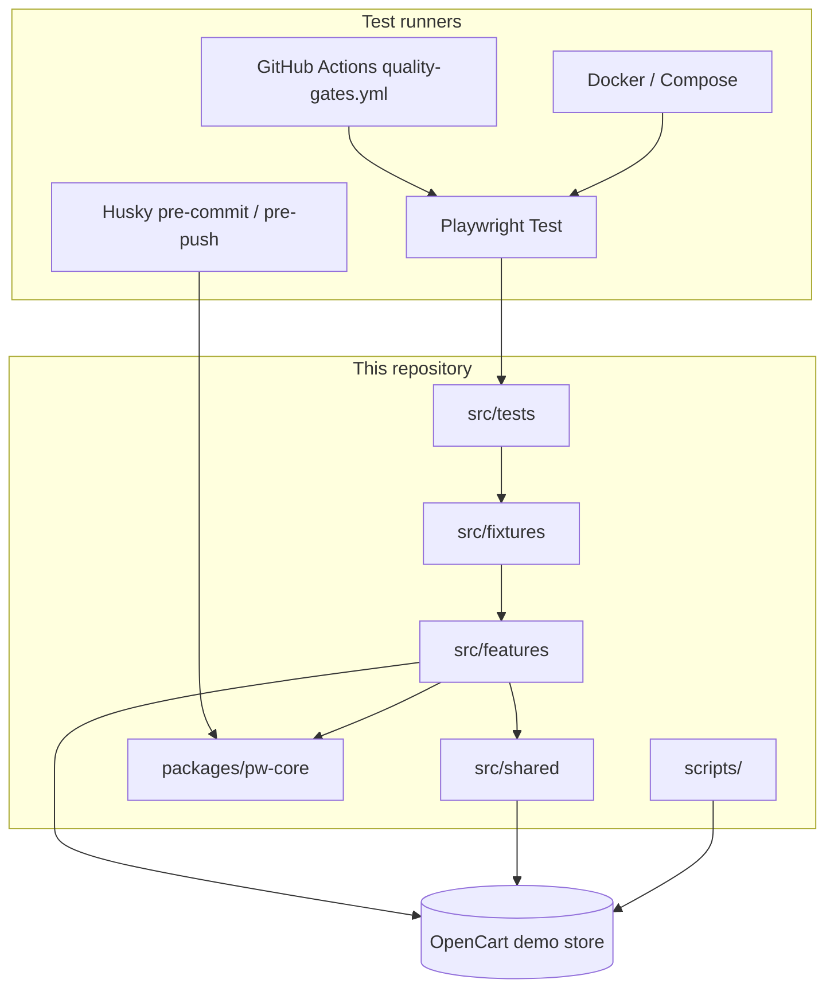
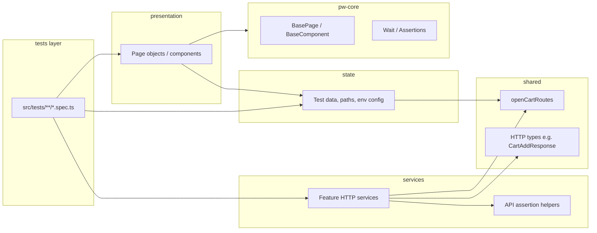
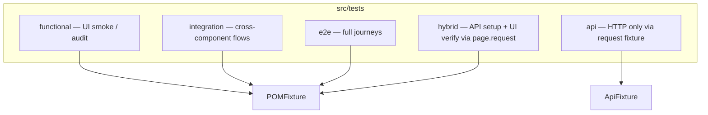
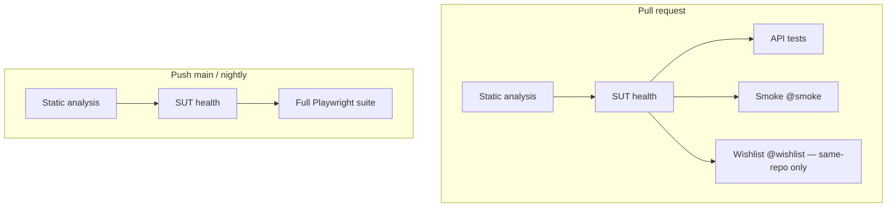

# Architecture — OpenCart Playwright Automation

This document describes the test automation system design for the OpenCart demo store (`BASE_URL`, default `https://awesomeqa.com/ui/`).

## System context

## Feature modules

Each domain area is an **independent feature module** under `src/features/<name>/`. Modules expose a public API through `index.ts` only.

| Feature      | State                                                                                                               | Services                             | Presentation                               |
| ------------ | ------------------------------------------------------------------------------------------------------------------- | ------------------------------------ | ------------------------------------------ |
| **home**     | `HomePaths`, `HeaderRoutes`, `uiConstants`, `footerContent`                                                         | —                                    | `HomePage`, `Header`, `Footer`             |
| **catalog**  | `products`, `ribbonMenu`, `searchMessages`, `alertMessages`, `getSearchTerm`, `requireProductId`, `requireCategory` | `CatalogService`, catalog assertions | `ProductListingPage`, `Ribbon`             |
| **cart**     | `CartPaths`                                                                                                         | `CartService`, cart assertions       | `CartPage`                                 |
| **auth**     | `credentials`, `AuthPaths`, URL patterns, `loginErrors`, `loginForm`, `logoutForm`                                  | —                                    | `LoginPage`, `LogoutPage`                  |
| **checkout** | `billingData`, `CheckoutBillingDetails`, `paths`, `uiConstants`                                                     | —                                    | `CheckoutPage`, `OrderPlacementResultPage` |
| **wishlist** | `WishlistPaths`, `uiConstants`                                                                                      | —                                    | `WishListPage`                             |

Auth credential **state** lives in `features/auth/state/credentials.ts`. Playwright skip/fail wiring for wishlist E2E is in `src/fixtures/wishlistCredentials.ts`.

### State module reference

| File                               | Feature  | Purpose                                                       |
| ---------------------------------- | -------- | ------------------------------------------------------------- |
| `home/state/paths.ts`              | home     | `HomePaths.home` from shared routes                           |
| `home/state/headerRoutes.ts`       | home     | Cart/checkout href fragments for header assertions            |
| `home/state/uiConstants.ts`        | home     | Brand title, search placeholder, store title, currency labels |
| `home/state/footerContent.ts`      | home     | Footer column headings and link labels                        |
| `catalog/state/products.ts`        | catalog  | Product catalog, helpers, `ribbonCategories`                  |
| `catalog/state/ribbonMenu.ts`      | catalog  | Ribbon dropdown and link labels (Software empty on SUT)       |
| `catalog/state/searchMessages.ts`  | catalog  | Empty search results message                                  |
| `catalog/state/alertMessages.ts`   | catalog  | Add-to-cart success alert fragments                           |
| `cart/state/paths.ts`              | cart     | `CartPaths`                                                   |
| `auth/state/paths.ts`              | auth     | Login/logout paths, login/logout URL patterns                 |
| `auth/state/credentials.ts`        | auth     | Wishlist credential resolution                                |
| `auth/state/loginErrors.ts`        | auth     | Login rejection pattern, failure message, timeout             |
| `auth/state/loginForm.ts`          | auth     | Returning Customer heading constants                          |
| `auth/state/logoutForm.ts`         | auth     | Account Logout heading and Continue link                      |
| `checkout/state/billingDetails.ts` | checkout | Guest billing fixture data and type                           |
| `checkout/state/paths.ts`          | checkout | Post-order Continue URL pattern                               |
| `checkout/state/uiConstants.ts`    | checkout | Order success heading and Continue link                       |
| `wishlist/state/paths.ts`          | wishlist | `WishlistPaths.list`                                          |
| `wishlist/state/uiConstants.ts`    | wishlist | Wishlist page heading                                         |

## Layer model (per feature)

### Import rules

| Layer            | May import                                     | Must not import                                                                      |
| ---------------- | ---------------------------------------------- | ------------------------------------------------------------------------------------ |
| **presentation** | Same-feature `state`, `@opencart-auto/pw-core` | Other features, `services`, test specs                                               |
| **state**        | `shared` routes/types, pw-core models          | `presentation`, `services`, other features' state                                    |
| **services**     | `shared`, same-feature `state`                 | `presentation`, other features' internals                                            |
| **tests**        | Feature `index.ts`, fixtures                   | Feature `presentation/` or `state/` paths directly; presentation classes via barrels |

**Cross-feature composition** happens in tests and fixtures (e.g. order flow uses catalog + cart + checkout page objects injected together).

Layer boundaries are enforced in `eslint.config.mjs` via `no-restricted-imports` on presentation, state, services, and tests. Tests must not import presentation classes from feature barrels (use fixtures instead).

## Shared layer

`src/shared/` holds cross-cutting infrastructure with **no UI and no test data**:

| Path                                | Contents                                                                       |
| ----------------------------------- | ------------------------------------------------------------------------------ |
| `services/routes/openCartRoutes.ts` | `home`, `search`, `cart`, `cartAdd`, `checkout`, `login`, `logout`, `wishlist` |
| `services/http/types.ts`            | Shared response types (e.g. `CartAddResponse`)                                 |

Feature `state` modules re-export route slices as domain paths (`CartPaths`, `AuthPaths`, `HomePaths`, `WishlistPaths`). Presentation uses feature state — not `shared` directly — except where state modules wrap shared routes (see ADR 006).

## pw-core workspace package

`packages/pw-core` is a **compile-time library** consumed by all features:

- `BasePage`, `BaseComponent`
- `SoftAssertions`, `HardAssertions`, `Wait`
- Generic interfaces: `IProduct`, `IBillingDetails`

It is built via `npm run build` (also `postinstall` / `pretest`). Output lives in `packages/pw-core/dist/` (gitignored). There is no separate unit-test runner; compile + Playwright specs validate behavior.

## Test taxonomy

| Layer                          | Fixture      | Typical imports                                      |
| ------------------------------ | ------------ | ---------------------------------------------------- |
| functional / integration / e2e | `POMFixture` | Page objects via fixtures                            |
| hybrid                         | `POMFixture` | Page objects + `sessionCartService` (`page.request`) |
| api                            | `ApiFixture` | `cartService`, `catalogService` (isolated `request`) |

`src/tests/seed.spec.ts` is generator scaffolding only (`testIgnore` in `playwright.config.ts`).

### Quality gate tags

| Tag         | Purpose           | Count   |
| ----------- | ----------------- | ------- |
| `@smoke`    | PR fast signal    | 8 tests |
| `@wishlist` | Authenticated E2E | 1 test  |

Details: [QUALITY-GATES.md](QUALITY-GATES.md).

## Fixtures

Playwright fixtures act as the DI container. Shared helpers live in `src/fixtures/fixtureHelpers.ts` (`pageObject`, `serviceFromRequest`, `serviceFromPageRequest`).

| File                     | Injects                                                                   |
| ------------------------ | ------------------------------------------------------------------------- |
| `POMFixture.ts`          | Feature presentation classes, `sessionCartService`, `wishlistCredentials` |
| `ApiFixture.ts`          | `CartService`, `CatalogService`                                           |
| `wishlistCredentials.ts` | Wishlist credential resolution and local skip (uses auth state barrel)    |

UI and hybrid tests import `test` from `POMFixture`. API tests import `test` from `ApiFixture`. Avoid constructing services or page objects directly in specs when a fixture exists.

## CI and quality gates

Workflow: [.github/workflows/quality-gates.yml](../.github/workflows/quality-gates.yml).

When `CI=true`, push/nightly runs **fail** if wishlist credentials are missing or placeholder (see [adr/002-ci-wishlist-credentials.md](adr/002-ci-wishlist-credentials.md)). Fork PRs skip the wishlist job without failing.

Local verification: [VERIFICATION.md](VERIFICATION.md). Contributor workflow: [CONTRIBUTING.md](CONTRIBUTING.md).

## Adding a new feature

1. Create `src/features/<name>/` with `state/`, `presentation/`, and optionally `services/`.
2. Export public API from `src/features/<name>/index.ts`.
3. Register presentation classes in `POMFixture.ts` if tests need them.
4. Add tests under the appropriate `src/tests/<layer>/` folder; tag with `@smoke` only when appropriate for PR gates.
5. Document scenarios in `specs/test.plan.md`.
6. Add an ADR for non-trivial boundary or CI decisions.

## Related decisions

| ADR                                             | Topic                                |
| ----------------------------------------------- | ------------------------------------ |
| [001](adr/001-feature-module-layers.md)         | Feature module layers                |
| [002](adr/002-ci-wishlist-credentials.md)       | Wishlist credentials in CI           |
| [003](adr/003-feature-scoped-api-services.md)   | Feature-scoped HTTP services         |
| [004](adr/004-login-presentation-separation.md) | Login vs wishlist landing assertions |
| [005](adr/005-layered-quality-gates.md)         | Layered CI, tags, Husky              |
| [006](adr/006-presentation-state-separation.md) | State extraction from presentation   |

Full index: [adr/README.md](adr/README.md).
