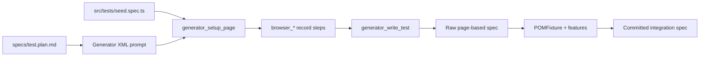

# Test generation from seed

This project uses [Playwright Test Generator](https://playwright.dev/docs/test-agents)–style agents (see `.github/agents/playwright-test-generator.agent.md`) to draft specs from `specs/test.plan.md`. The **seed file** is the generator anchor; the **committed test** uses `POMFixture` and feature page objects.

## Seed file

| File                     | Role                                                                                                       |
| ------------------------ | ---------------------------------------------------------------------------------------------------------- |
| `src/tests/seed.spec.ts` | Empty scaffold for `generator_setup_page`; **excluded** from CI via `testIgnore` in `playwright.config.ts` |

The seed is not the final test — it only bootstraps browser recording.

## Showcase examples

Both specs share the same seed file and refactor pattern; only the ribbon category differs.

| Category      | Test plan section                 | Refactored spec                                                                   |
| ------------- | --------------------------------- | --------------------------------------------------------------------------------- |
| Tablets       | Showcase — Tablets category       | [TabletsCategory.spec.ts](../src/tests/integration/TabletsCategory.spec.ts)       |
| Phones & PDAs | Showcase — Phones & PDAs category | [PhonesPDAsCategory.spec.ts](../src/tests/integration/PhonesPDAsCategory.spec.ts) |

**Seed:** `src/tests/seed.spec.ts`  
**Test plan:** [specs/test.plan.md](../specs/test.plan.md)

> **Note:** The **Software** ribbon category is empty on the demo store (`Software (0)`). Use a category with catalog items (e.g. Phones & PDAs, Cameras) for product-listing assertions.

### Tablets category integration

### Generator input (XML)

Use with the `playwright-test-generator` agent:

```xml
<test-suite>Ribbon Category Navigation → Tablets</test-suite>
<test-name>clicking Tablets loads the Tablets category page</test-name>
<test-file>src/tests/integration/TabletsCategory.spec.ts</test-file>
<seed-file>src/tests/seed.spec.ts</seed-file>
<body>
1. Navigate to the OpenCart home page.
2. Click "Tablets" in the ribbon navigation.
3. Verify the category heading is "Tablets".
4. Verify at least one product is listed.
</body>
```

### Typical generator output (before refactor)

```typescript
import { test, expect } from '@playwright/test';

test.describe('Ribbon Category Navigation → Tablets', () => {
    test('clicking Tablets loads the Tablets category page', async ({ page }) => {
        // seed: src/tests/seed.spec.ts
        await page.goto('https://awesomeqa.com/ui/');
        await page.getByRole('link', { name: 'Tablets' }).click();
        await expect(page.getByRole('heading', { name: 'Tablets', level: 2 })).toBeVisible();
        await expect(page.locator('.product-thumb').first()).toBeVisible();
    });
});
```

### Project-standard version (after refactor)

The committed spec imports `test` from `POMFixture` and uses `HomePage`, `Ribbon`, and `ProductListingPage` from feature modules — same flow, aligned with [docs/ARCHITECTURE.md](ARCHITECTURE.md).

### Phones & PDAs category integration

```xml
<test-suite>Ribbon Category Navigation → Phones & PDAs</test-suite>
<test-name>clicking Phones & PDAs loads the Phones & PDAs category page</test-name>
<test-file>src/tests/integration/PhonesPDAsCategory.spec.ts</test-file>
<seed-file>src/tests/seed.spec.ts</seed-file>
<body>
1. Navigate to the OpenCart home page.
2. Click "Phones & PDAs" in the ribbon navigation.
3. Verify the category heading is "Phones & PDAs".
4. Verify at least one product is listed.
</body>
```

After refactor, the spec uses `ribbonCategories.PHONES_PDAS` from `src/features/catalog/state/products.ts`.

### Run the showcase tests

```sh
npx playwright test src/tests/integration/TabletsCategory.spec.ts
npx playwright test src/tests/integration/PhonesPDAsCategory.spec.ts
```

## Workflow summary



After generation, always:

1. Replace `@playwright/test` fixture imports with `POMFixture` where UI page objects apply.
2. Move locators into presentation classes under `src/features/*/presentation/`.
3. Add or update the scenario in `specs/test.plan.md`.
4. Run `npm run typecheck`, `npm run lint`, and the new spec.
